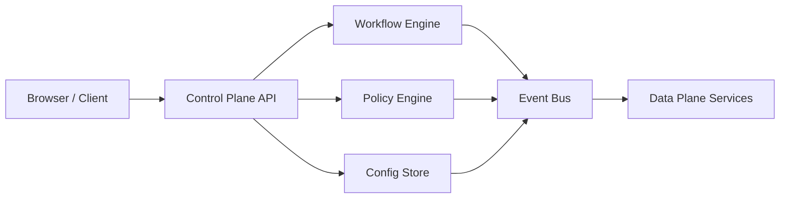
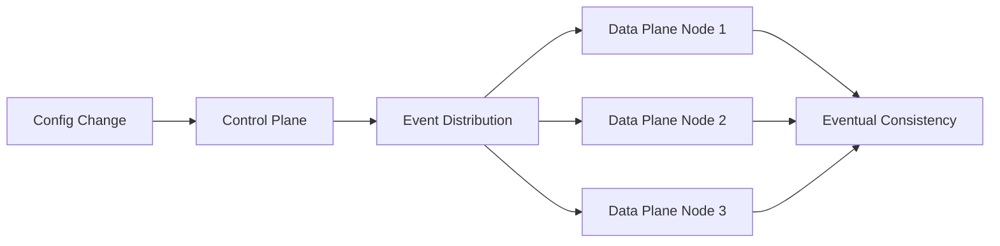
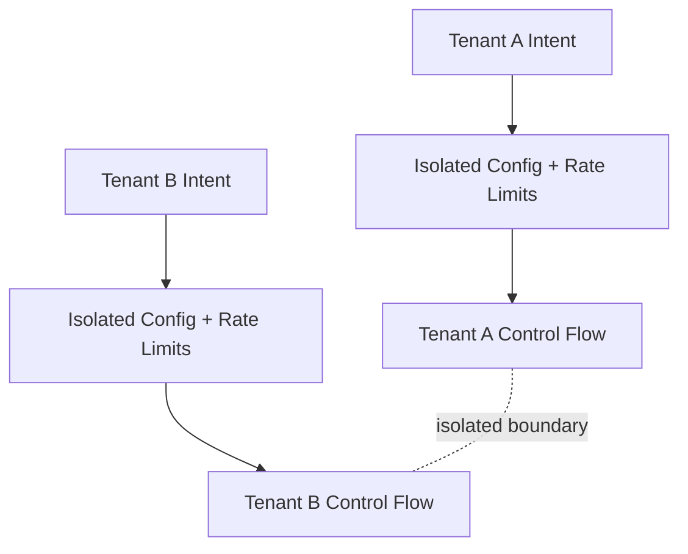

# Designing a Multitenant Control Plane Workflow Platform

The **Multitenant Control Plane Workflow Platform** is the canonical reference implementation for this control-plane architecture series. Every concept in this cluster maps back to this system, not to an abstract generic stack.

## 1) System Overview

This platform is a control plane responsible for:

- workflow orchestration
- policy evaluation
- configuration distribution

It serves multiple tenants concurrently while preserving hard isolation guarantees around execution ownership, decision state, throughput entitlements, and failure boundaries.

In this model, the control plane is not just an API facade. It is the decision authority that computes safe, policy-compliant execution intent and publishes that intent to data-plane services.

## 2) Core Architecture

The platform is composed of six explicit subsystems:

1. **Control Plane API Layer**
   - Receives tenant-scoped intent (create workflow, update policy, push config).
   - Enforces authentication, tenant binding, request shaping, and idempotency keys.

2. **Workflow Engine (Decision System)**
   - Evaluates current workflow state + event history.
   - Produces deterministic next-step decisions and side-effect intents.

3. **Policy Engine**
   - Executes authorization, guardrails, and rollout rules per decision.
   - Owns policy versioning and policy-evaluation determinism.

4. **Config Store (Versioned)**
   - Stores tenant-scoped configuration snapshots with monotonic versions.
   - Supports point-in-time replay for incident and audit reconstruction.

5. **Event Propagation System**
   - Publishes decision/config updates to subscribers asynchronously.
   - Tracks delivery progress and lag across fanout partitions.

6. **Tenant Isolation Layer**
   - Enforces resource, concurrency, and blast-radius isolation per tenant.
   - Separates scheduler fairness from execution priority.

## 3) Mental Model

- **Control Plane:** decides **WHAT** should happen.
- **Data Plane:** executes **WHAT** was decided.

This boundary is non-negotiable. Once this line blurs, operators cannot prove correctness under retry, replay, failover, or partial propagation.

## 4) Multi-Tenancy Model

### Tenant isolation strategies

- Namespace isolation for workflow state and policy artifacts.
- Per-tenant execution pools for noisy-neighbor containment.
- Token-bucket admission boundaries by tenant and operation class.

### Config scoping

- Global defaults -> environment scope -> tenant overrides.
- Effective config is computed as a versioned, immutable snapshot.
- All propagated decisions reference an explicit `(tenant_id, config_version)` pair.

### Rate limiting per tenant

- Baseline QPS quota per tenant tier.
- Burst budget with bounded depletion window.
- Priority classes so transactional decisions out-rank batch workflows.

### Failure isolation

- Tenant-level circuit state to quarantine failing tenants without global rollback.
- Partitioned queues so hot tenant traffic cannot starve control decisions for others.

## 5) Propagation Model

The platform uses asynchronous propagation with eventual consistency and explicit convergence targets.

- Control plane commits decision/config state first.
- Event distribution fans out updates to data-plane subscribers.
- Subscribers apply updates idempotently using monotonic version checks.
- Convergence is measured as max-version skew and apply-lag SLOs.

### Convergence guarantees

- **Per-tenant monotonicity:** no subscriber may apply version `n+1` before `n` for same keyspace.
- **Bounded staleness objective:** skew must remain within a published staleness envelope.
- **Repair path:** out-of-sync subscribers request snapshot replay from config store.

## 6) Failure Modes

### Partial propagation
Some data-plane nodes apply version `v+1` while others remain on `v`, creating split behavior.

### Stale decisions
Workflow engine makes valid decisions against stale policy/config snapshots when propagation lag exceeds policy tolerance.

### Tenant-level blast radius
Without per-tenant isolation, one tenant’s retry storm or malformed config can consume shared control-plane resources.

### Control plane overload
Decision queues saturate, increasing control latency and causing stale intent publication to the data plane.

## 7) Scaling Strategy

### Horizontal scaling of decision layer
- Stateless API and deterministic decision workers scale out independently.
- Workflow engine sharding keyed by tenant + workflow partition.

### Partitioning by tenant
- Primary partition key: tenant.
- Secondary key: workflow family or resource class to smooth hotspots.

### Fanout control
- Adaptive fanout windows based on subscriber lag.
- Priority-aware propagation so safety-critical updates preempt low-value changes.

## 8) Design Tradeoffs

### Consistency vs latency
Stronger synchronization reduces stale reads but increases decision and propagation latency during peaks.

### Centralization vs edge distribution
Centralized decision logic improves auditability and policy uniformity; edge distribution reduces reaction latency but increases divergence risk.

### Isolation vs efficiency
Hard tenant boundaries improve safety and debuggability, but reduce global bin-packing efficiency and may increase idle reserve capacity.

## 9) Strong Opinion

- **Most control planes fail due to hidden propagation assumptions.**
- **Multi-tenancy amplifies control plane risk, not just complexity.**

If propagation lag, ordering, and replay semantics are not modeled as first-class architecture constraints, the control plane is not production-ready.

## High-Level Architecture Diagram

## Propagation Diagram

## Multi-Tenant Isolation Diagram

